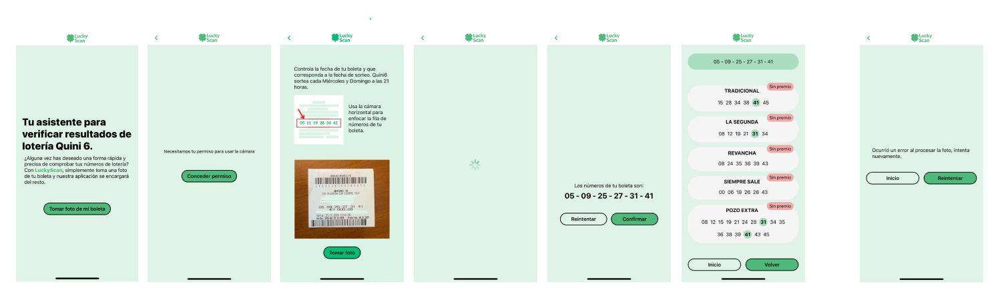

# Lucky Scan

## Descripción

`Lucky Sacan` es una aplicación desarrollada en React Native con Expo, que simplifica el proceso de verificación de resultados de la lotería Quini6. Esta app permite a los usuarios:

- Leer los números de tu ticket: Extrae los números de tu ticket a partir de una foto tomada desde la app.
- Consultar los resultados del sorteo: Obtiene los números ganadores de la lotería haciendo scraping a la web oficial.
- Validar aciertos: Compara los números de tu ticket con los resultados del sorteo y te indica si tienes premios.

Esta aplicación fue desarrollada para solucionar el tedioso proceso de verificar manualmente los resultados en la web oficial desde dispositivos iOS, eliminando la necesidad de ingresar números en múltiples inputs y teclados.



1. [Características Principales](#características-principales)
2. [Requisitos Previos](#requisitos-previos)
3. [Configuración Local](#configuración-local)
   - [1. Clonar el Repositorio](#1-clonar-el-repositorio)
   - [2. Instalar Dependencias](#2-instalar-dependencias)
   - [3. Configurar Variables de Entorno](#3-configurar-variables-de-entorno)
   - [4. Ejecutar el Backend](#4-ejecutar-el-backend)
   - [5. Ejecutar la App](#5-ejecutar-la-app)
   - [6. Prueba las Funcionalidades](#6-prueba-las-funcionalidades)
4. [Estructura del Proyecto](#estructura-del-proyecto)
   - [Frontend (React Native Expo)](#frontend-react-native-expo)
5. [Tecnologías Utilizadas](#tecnologías-utilizadas)
6. [Custom Hook useRenderState](#custom-hook-userenderstate)
7. [Fetch en lugar de axios](#fetch-en-lugar-de-axios)
8. [Futuras Funcionalidades](#futuras-funcionalidades)
9. [Contribuciones](#contribuciones)
10. [Licencia](#licencia)

## Características Principales

[Volver arriba](#lucky-scan)

1. `Extracción de Números desde Foto`:

- A partir de una foto del ticket, se usa OCR para leer los números jugados automáticamente.
- El usuario puede confirmar los números antes de proceder.

2. `Scraping de Resultados`:

- La app realiza una consulta a la web de la lotería utilizando el backend para obtener los números ganadores.
- La URL de la web se pasa al backend a través de una variable de entorno.

3. `Validación de Aciertos`:

- Compara los números del ticket con los resultados del sorteo y muestra los aciertos.
- Indica si el usuario tiene algún premio basado en los números coincidentes.

## Requisitos Previos

[Volver arriba](#lucky-scan)

- Backend:

  - Debes tener un backend funcional que realice scraping y extracción de texto desde imágenes.
  - El backend para este proyecto fue desarrollado en Python y utiliza fastApi, BeautifulSoup, pytesseract y cv2 (Pronto dejaré aquí la URL del repositorio).

- Dependencias del Proyecto:
  - Node.js y npm.
  - Un dispositivo físico o emulador con Expo Go instalado.
  - Ticket de la loteria Quini6.
  - Variables de entorno: EXPO_PUBLIC_API_URL (URL del backend) y EXPO_PUBLIC_SCRAPE_URL (URL de la web de la lotería para scraping).

## Configuración Local

[Volver arriba](#lucky-scan)

Sigue estos pasos para ejecutar la app en tu entorno local:

1. Clonar el Repositorio. Clona este repositorio en tu máquina local:

```bash
git clone <REPOSITORIO_URL>
cd <NOMBRE_DEL_REPOSITORIO>
```

2. Instalar Dependencias. Ejecuta el siguiente comando para instalar todas las dependencias necesarias:

```bash
npm install
```

3. Configurar Variables de Entorno. Crea un archivo .env en la raíz del proyecto y define las siguientes variables de entorno:

```env
EXPO_PUBLIC_API_URL=http://<URL_DEL_BACKEND_LOCAL>:<PUERTO>
EXPO_PUBLIC_SCRAPE_URL=https://<URL_DE_LA_LOTERIA>
```

- EXPO_PUBLIC_API_URL: URL donde está corriendo el backend.
- EXPO_PUBLIC_SCRAPE_URL: URL de la web de la lotería para scraping.

4. Ejecutar el Backend. Antes de ejecutar la app, asegúrate de que el backend esté corriendo. Dependiendo de cómo hayas configurado tu backend, puedes iniciar el servidor localmente, por ejemplo:

```bash
docker-compose up --build
# o
npm run start
```

Confirma que el backend está activo y accesible desde la URL definida en EXPO_PUBLIC_API_URL.

5. Ejecutar la App

- Inicia el entorno de desarrollo de Expo:

```bash
npx expo start
```

Esto abrirá una ventana en tu navegador con un código QR. Escanea este código usando Expo Go en tu dispositivo móvil o utiliza un emulador de iOS/Android conectado.

6. Prueba las Funcionalidades

   1. Extracción de Números desde Foto:

   - Toma una foto de tu ticket de lotería desde la app. La app enviará la imagen al backend, que procesará la foto para extraer los números jugados.

   2. Scraping de Resultados y verificación de Resultados:

   - Confirma los números extraídos del ticket.
   - La app hará una solicitud al backend para obtener los números ganadores de la lotería desde la web oficial.
   - Compara los números con los resultados del sorteo y revisa tus aciertos.

## Estructura del Proyecto

[Volver arriba](#lucky-scan)

### Frontend (React Native Expo)

- Pantallas principales:

  - `Home`: Landing de la app.
  - `Photo`: Toma una foto del ticket y extrae los números jugados.
  - `Results`: Consulta los resultados del sorteo y verifica los aciertos.

- Hooks personalizados:

  - `useProcessPhoto`: Para manejar el flujo de procesamiento de fotos.
  - `useScraping`: Para manejar el scraping de los resultados.
  - `useRenderState`: Para manejar el estado de renderizado de la app (cargando, error, éxito).

- Variables de entorno:

  - Configuradas para obtener los endpoints del backend de manera dinámica: `EXPO_PUBLIC_API_URL` y `EXPO_PUBLIC_SCRAPE_URL`.

## Tecnologías Utilizadas

[Volver arriba](#lucky-scan)

- Frontend:

  - React Native Expo: Para el desarrollo de la aplicación móvil multiplataforma.
  - React Router: Para la navegación entre pantallas.
  - Fetch: Para realizar solicitudes HTTP al backend.
  - Expo Camera: Para acceder a la cámara del dispositivo y tomar fotos.
  - Expo Image Manipulator: Para procesar las imágenes capturadas.
  - Typscript: Para tipado estático.

- Backend:

  - Python: Lenguaje de programación principal.
  - FastAPI: Framework web para construir APIs de manera rápida y eficiente.
  - BeautifulSoup: Para analizar el HTML y extraer datos.
  - pytesseract: Para la extracción de texto de imágenes.
  - cv2 (OpenCV): Para el procesamiento de imágenes.

## Custom Hook useRenderState

[Volver arriba](#lucky-scan)

El custom hook `useRenderState` de la app es un hook personalizado diseñado para manejar de manera eficiente los estados de carga (loading), error y éxito en una aplicación React Native. Es especialmente útil para componentes que dependen de datos asincrónicos o que deben mostrar diferentes vistas según el estado actual.

#### ¿Por Qué Usar useRenderState?

1. Simplifica el Manejo de Estados Comunes:

   - Muchas aplicaciones deben gestionar estados como "cargando", "error" o "éxito" cuando realizan solicitudes HTTP, tareas asíncronas o cargas de datos. Este hook abstrae esa lógica, evitando repetir el mismo código en cada componente.

2. Reutilización:

   - Centraliza la lógica para manejar estados en un solo lugar. Esto reduce la duplicación de código y garantiza consistencia en toda la aplicación.

3. Personalización:

   - Permite pasar componentes personalizados para cada estado (loading, error, success) a través de customComponents. Esto lo hace altamente flexible y adaptable a cualquier diseño o necesidad.

4. Flexibilidad con Datos:

   - Integra de forma nativa los datos (data) en el estado de éxito (success), lo que facilita su renderización o paso a otros componentes.

5. Mejora de la Legibilidad:

   - Simplifica el código en los componentes que lo usan, manteniendo la lógica de renderizado más clara y concisa.

#### Impacto en la Consistencia Visual

1. Mismos Componentes para Estados Comunes:

   - Al definir componentes predeterminados para cada estado (loading, error, success), el hook asegura que en toda la aplicación, los estados visuales se vean consistentes.
   - Ejemplo: Si usas el mismo spinner (<Spinner />) para todos los estados de carga, los usuarios verán un diseño uniforme, lo que refuerza la identidad visual de la app.

2. Estilo Unificado:

   - Los mensajes de error, carga o éxito tienen un diseño común y pueden ser personalizados fácilmente con customComponents. Esto evita que diferentes pantallas o desarrolladores implementen estilos o diseños distintos.
   - Sin el Hook: Cada componente podría manejar los estados de forma diferente, lo que crea una experiencia de usuario inconsistente.

   - Con el Hook: Todos los componentes siguen el mismo patrón, garantizando consistencia en las transiciones entre estados.

3. Facilidad para Cambios Globales:

   - Si necesitas ajustar el diseño (por ejemplo, cambiar el estilo del mensaje de error o usar un nuevo componente para loading), puedes hacerlo en un solo lugar (dentro del hook), y el cambio se reflejará en toda la app.
   - Esto asegura que cualquier cambio en el diseño o en la experiencia visual sea coherente en toda la aplicación.

4. Prevención de Errores Visuales:

   - Con el hook centralizando la lógica y los componentes visuales para los estados, reduces el riesgo de errores, como mostrar mensajes de error con estilos incorrectos o spinners mal alineados.

#### Ventajas del Diseño

1. Estandarización:

   - El uso de ERenderState (enum) asegura consistencia y evita errores de tipo al determinar el estado.

2. Escalabilidad:

   - Es fácil de extender. Puedes agregar nuevos estados (por ejemplo, "vacío" o "deshabilitado") al enum y manejar esos casos en el hook.

3. Fácil Integración:

   - Compatible con cualquier componente de React Native. Solo necesitas pasar los estados necesarios.

4. Consistencia Visual:

   - Proporciona una experiencia uniforme para el usuario, con transiciones fluidas y estilos consistentes en toda la app.

## Fetch en lugar de axios

[Volver arriba](#lucky-scan)

En este proyecto, se utiliza fetch en lugar de axios por las siguientes razones:

- `Ligereza`: fetch es una API nativa de JavaScript, por lo que no se necesita instalar dependencias adicionales, lo que reduce el tamaño del proyecto.
- `Adecuado para Solicitudes Simples`: Las dos solicitudes HTTP del proyecto son sencillas y no requieren características avanzadas como interceptores o transformaciones automáticas.

## Futuras Funcionalidades

[Volver arriba](#lucky-scan)

Estas son algunas características planificadas para futuras versiones de la app:

1. **Notificaciones en Tiempo Real**:
   - Enviar alertas cuando:
     - Los resultados del sorteo estén disponibles.
     - Se acerque la fecha de un próximo sorteo.
     - Si la foto del ticket fue tomada y guardada previamente, enviar una notificación cuando los resultados de mi ticket.
2. **Historial de Números Jugados**:
   - Guardar el ticket escaneado al momento de la compra, esperando la fecha de sorteo para verificar los resultados.
3. **Diseño Mejorado**:
   - Nuevas interfaces más intuitivas y atractivas para mejorar la experiencia del usuario.

Si tienes ideas o sugerencias, no dudes en abrir un issue o contribuir al proyecto.

## Contribuciones

[Volver arriba](#lucky-scan)

Si deseas contribuir al proyecto, por favor abre un pull request o crea un issue para discutir los cambios. Igualmente si tienes competarios para mejorar la app, estoy abierta a sugerencias. ¡Gracias por tu interés!

## Licencia

[Volver arriba](#lucky-scan)

Este proyecto está bajo la licencia MIT. Consulta el archivo [LICENSE](./LICENSE) para más detalles.
